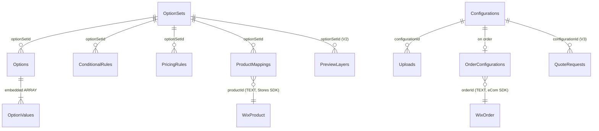

# 04 — Database Design Specification

**Scope:** Phase 4 (database). Defines every Wix Data collection PCP installs: fields, types,
relationships, indexes, validation strategy, permissions, and retention. Grounded in the Wix Data
constraints surfaced in doc 03 and the `wix-app` skill's `DATA_COLLECTION` / `WIX_DATA` references.

---

## 1. Wix Data rules that shape this design (must-read)

These platform constraints are non-negotiable and explain every modeling choice below:

1. **No field-level `required` / `unique` / `default`.** Enforce **required** at the insert path
   (web method / engine), declare **unique** in the collection `indexes` array (`unique: true`), set
   **defaults** at the insert path or via `initialData`.
2. **`REFERENCE` / `MULTI_REFERENCE` may only link to other *app* collections — never to Wix entities**
   (Products, Orders, Contacts, Members). Wix entity links are stored as **TEXT IDs** and resolved via
   the relevant SDK (Stores/eCom).
3. **System fields are automatic:** `_id`, `_createdDate`, `_updatedDate`, `_owner`. Do not redeclare.
4. **Collection IDs are scoped** `<app-namespace>/<idSuffix>` (case-sensitive, no camelCase transform).
   The namespace is **MA-1** (from Dev Center). `idSuffix` values are fixed below.
5. **Permissions are context-based per operation** (`itemRead`, `itemInsert`, `itemUpdate`,
   `itemRemove`). Public storefront reads need `ANYONE`; dashboard writes use `CMS_EDITOR` /
   `PRIVILEGED` / `ADMIN`.
6. **`OBJECT` fields require `objectOptions`; `ARRAY`/`ARRAY_STRING` for lists.** Complex nested
   structures (option values, rule trees, pricing config) are modeled as `OBJECT`/`ARRAY` payloads
   where they are tightly owned by a parent, and as separate collections where they are queried or
   shared independently.
7. **`@wix/data` API:** `items.query/get/insert/update/save/remove/bulkInsert/bulkUpdate/bulkRemove`.
   `update` requires `_id` inside the object.

### 1.1 Collection ID registry (`idSuffix`)

| Collection | `idSuffix` | Full ID |
|-----------|------------|---------|
| OptionSets | `option-sets` | `<namespace>/option-sets` |
| Options | `options` | `<namespace>/options` |
| ConditionalRules | `conditional-rules` | `<namespace>/conditional-rules` |
| PricingRules | `pricing-rules` | `<namespace>/pricing-rules` |
| ProductMappings | `product-mappings` | `<namespace>/product-mappings` |
| Uploads | `uploads` | `<namespace>/uploads` |
| Configurations | `configurations` | `<namespace>/configurations` |
| OrderConfigurations | `order-configurations` | `<namespace>/order-configurations` |
| AnalyticsEvents | `analytics-events` | `<namespace>/analytics-events` |
| Templates | `templates` | `<namespace>/templates` |
| Settings | `settings` | `<namespace>/settings` |
| AuditLogs | `audit-logs` | `<namespace>/audit-logs` |
| PreviewLayers *(V2)* | `preview-layers` | `<namespace>/preview-layers` |
| QuoteRequests *(V3)* | `quote-requests` | `<namespace>/quote-requests` |

> **Modeling note — option values:** option *values* are modeled as an `ARRAY` of `OBJECT` **inside**
> `Options` (they are always loaded with their option and never queried independently), not as a 13th
> "OptionValues" collection. This avoids N+1 reads on the storefront hot path. The PRD's enumerated
> 12 collections are all present; PreviewLayers and QuoteRequests are added for V2/V3 scope.

### 1.2 Conventions used in the field tables

- **Type** = Wix Data field type. **Req** = enforced-required at insert path (not a DB feature).
- **Idx** = participates in an index (see each collection's Indexes block).
- Money is stored as **string** (currency-safe, matches eCom/V3). Booleans default at insert path.

---

## 2. Core collections

### 2.1 `OptionSets`
A reusable, named group of options. Parent of Options/Rules/Pricing.

| Field | Type | Req | Idx | Notes |
|-------|------|:---:|:---:|-------|
| `name` | TEXT | ✓ | ✓ (unique) | Unique per instance (enforced via index + insert check). |
| `slug` | TEXT | ✓ | ✓ | URL/key-safe; unique per instance. |
| `status` | TEXT | ✓ | ✓ | `draft` \| `published` \| `archived`. Default `draft`. |
| `description` | TEXT | – | – | Merchant note. |
| `version` | NUMBER | ✓ | – | Increments on publish; storefront reads published version. |
| `isDemo` | BOOLEAN | ✓ | ✓ | Marks seeded demo data (PCP-ONB-1). Default `false`. |
| `optionOrder` | ARRAY_STRING | – | – | Ordered list of `Options._id` (authoritative ordering). |
| `settingsOverride` | OBJECT | – | – | Per-set overrides (multi-step on/off, rounding). |
| `instanceId` | TEXT | ✓ | ✓ | Tenant scoping (defense in depth alongside `_owner`). |

- **Relationships:** 1→N `Options`, `ConditionalRules`, `PricingRules` (via their `optionSetId` TEXT).
  N↔N products via `ProductMappings`.
- **Indexes:** unique(`instanceId`,`name`); unique(`instanceId`,`slug`); (`instanceId`,`status`);
  (`instanceId`,`isDemo`).
- **Validation:** name/slug non-empty + unique; status in enum; version ≥ 1.
- **Permissions:** read `ANYONE` **only when** `status=published` (enforced by querying published in the
  public read path; admin reads are `ADMIN`/`CMS_EDITOR`); insert/update/remove `ADMIN`/`CMS_EDITOR`.
- **Retention:** retained for app lifetime; purged on `App Removed` per retention policy.

### 2.2 `Options`
A single configurable input within an Option Set; embeds its values.

| Field | Type | Req | Idx | Notes |
|-------|------|:---:|:---:|-------|
| `optionSetId` | TEXT | ✓ | ✓ | FK→`OptionSets._id`. |
| `instanceId` | TEXT | ✓ | ✓ | Tenant scope. |
| `label` | TEXT | ✓ | – | Display label. |
| `key` | TEXT | ✓ | ✓ | Stable key, unique within set (engine references). |
| `type` | TEXT | ✓ | ✓ | `short_text`,`long_text`,`number`,`dropdown`,`radio`,`checkbox`,`multi_select`,`swatch`,`button_group`,`date`,`time`,`file`,`quantity`,`hidden`,`section`,`note`. |
| `order` | NUMBER | ✓ | ✓ | Sort order within set. |
| `required` | BOOLEAN | ✓ | – | Default `false`. Authoritative requiredness can be overridden by rules at runtime. |
| `helpText` | TEXT | – | – | Inline guidance. |
| `defaultValueKey` | TEXT | – | – | Default selected value key. |
| `values` | ARRAY (OBJECT) | – | – | `{ key, label, imageRef?, swatch?, isDefault?, order }[]` (embedded). |
| `validation` | OBJECT | – | – | `{ min?, max?, step?, minLen?, maxLen?, regex?, regexMessage?, fileTypes?[], maxSizeMb?, maxCount? }`. |
| `pricingHint` | OBJECT | – | – | Denormalized quick-price for preview (authoritative pricing in `PricingRules`). |
| `sectionId` | TEXT | – | ✓ | Groups option under a `section`-type option (multi-step). |

- **Relationships:** N→1 `OptionSets`. Values embedded (not a separate collection).
- **Indexes:** (`instanceId`,`optionSetId`,`order`); unique(`optionSetId`,`key`); (`instanceId`,`type`).
- **Validation:** key unique in set; type in enum; type-specific config valid (e.g. swatch must have
  ≥1 value; number min≤max; valid regex). Cannot **publish** parent set if invalid (draft allowed).
- **Permissions:** read `ANYONE` for published sets (public read path filters by published set);
  writes `ADMIN`/`CMS_EDITOR`.
- **Retention:** with parent set.

### 2.3 `ConditionalRules`
Show/hide/require/value logic for a set. Stores a nested condition tree as `OBJECT`.

| Field | Type | Req | Idx | Notes |
|-------|------|:---:|:---:|-------|
| `optionSetId` | TEXT | ✓ | ✓ | FK→`OptionSets._id`. |
| `instanceId` | TEXT | ✓ | ✓ | Tenant scope. |
| `name` | TEXT | ✓ | – | Merchant-facing rule name. |
| `priority` | NUMBER | ✓ | ✓ | Conflict resolution order (PCP-RUL-4). |
| `enabled` | BOOLEAN | ✓ | ✓ | Default `true`. |
| `conditionTree` | OBJECT | ✓ | – | `{ combinator: 'ALL'|'ANY', conditions: [...], groups: [ {combinator, conditions, groups} ] }` — nested ≤ max depth (default 5). |
| `actions` | ARRAY (OBJECT) | ✓ | – | `{ type: 'show'|'hide'|'require'|'optional'|'set_value'|'set_available_values', targetOptionKey, payload? }[]`. |
| `isValid` | BOOLEAN | ✓ | ✓ | Engine-computed; invalid rules excluded from evaluation (PCP-RUL-1 EC). |
| `invalidReason` | TEXT | – | – | Why a rule is invalid (dangling reference, empty group). |

- **Relationships:** N→1 `OptionSets`. References Options by **key** (not `_id`) inside the tree/actions.
- **Indexes:** (`instanceId`,`optionSetId`,`priority`); (`optionSetId`,`enabled`); (`optionSetId`,`isValid`).
- **Validation:** non-empty groups; depth ≤ max; referenced option keys exist; cycle detection at save
  (PCP-RUL-3). Invalid rules persist as `isValid=false` rather than blocking the save.
- **Permissions:** read `ANYONE` (published sets) for storefront evaluation; writes `ADMIN`/`CMS_EDITOR`.
- **Retention:** with parent set.

### 2.4 `PricingRules`
Price adjustments; reuses the same condition grammar plus pricing-specific config.

| Field | Type | Req | Idx | Notes |
|-------|------|:---:|:---:|-------|
| `optionSetId` | TEXT | ✓ | ✓ | FK→`OptionSets._id`. |
| `instanceId` | TEXT | ✓ | ✓ | Tenant scope. |
| `name` | TEXT | ✓ | – | Rule name. |
| `pricingType` | TEXT | ✓ | ✓ | `fixed`,`percentage`,`formula`,`quantity`,`tier`,`conditional`. |
| `priority` | NUMBER | ✓ | ✓ | Composition order within type. |
| `enabled` | BOOLEAN | ✓ | ✓ | Default `true`. |
| `target` | OBJECT | ✓ | – | What it applies to: `{ scope:'option'|'value'|'set', optionKey?, valueKey? }`. |
| `config` | OBJECT | ✓ | – | Type-specific: fixed `{amount, isDiscount?}`; percentage `{percent, base:'product'|'subtotal', rounding?}`; formula `{expression, variables[]}`; quantity `{breaks:[{min,max?,amount,perUnit?}]}`; tier `{tiers:[{matchValueKey|range,amount}]}`. |
| `conditionTree` | OBJECT | – | – | Optional guard (same grammar as ConditionalRules) for `conditional` type or any guarded rule. |
| `currency` | TEXT | – | – | Informational; store currency is authoritative at checkout. |
| `isValid` | BOOLEAN | ✓ | ✓ | Engine-validated (e.g. valid formula grammar, non-overlapping breaks). |
| `invalidReason` | TEXT | – | – | Diagnostic. |

- **Relationships:** N→1 `OptionSets`. References Options/values by key.
- **Indexes:** (`instanceId`,`optionSetId`,`pricingType`,`priority`); (`optionSetId`,`enabled`);
  (`optionSetId`,`isValid`).
- **Validation:** formula grammar whitelisted + parses (PCP-PRC-3); quantity breaks non-overlapping;
  tiers resolvable; amounts numeric; percentage within sane bounds. Invalid → `isValid=false`.
- **Permissions:** read `ANYONE` (published sets); writes `ADMIN`/`CMS_EDITOR`. **Note:** the
  authoritative charge is computed by the Additional Fees SPI reading these rules elevated.
- **Retention:** with parent set.

### 2.5 `ProductMappings`
Associates an Option Set with a Wix Stores product. **Product link is TEXT** (Wix Data can't reference
Stores).

| Field | Type | Req | Idx | Notes |
|-------|------|:---:|:---:|-------|
| `instanceId` | TEXT | ✓ | ✓ | Tenant scope. |
| `productId` | TEXT | ✓ | ✓ | Wix Stores product ID (V1 or V3). Resolved via Stores SDK. |
| `catalogVersion` | TEXT | ✓ | – | `V1` \| `V3` captured at mapping time. |
| `optionSetId` | TEXT | ✓ | ✓ | FK→`OptionSets._id`. At most one active per product. |
| `active` | BOOLEAN | ✓ | ✓ | Default `true`. |
| `stale` | BOOLEAN | ✓ | ✓ | Set by Stores event when product deleted/changed (PCP-MAP-1 EC). Default `false`. |
| `assignmentSource` | TEXT | – | – | `manual` \| `collection` \| `category` (bulk assign provenance). |
| `sourceRef` | TEXT | – | – | Collection/category ID for bulk-assigned mappings. |

- **Relationships:** N→1 `OptionSets`; product via TEXT ID (resolved through `catalog.ts`).
- **Indexes:** unique(`instanceId`,`productId`,`active`) — at most one active mapping per product;
  (`instanceId`,`optionSetId`); (`instanceId`,`stale`).
- **Validation:** product exists at assign time (Stores query); one active set per product (reassign
  confirms overwrite).
- **Permissions:** read `ANYONE` (storefront must resolve product→set quickly); writes `ADMIN`/`CMS_EDITOR`.
- **Retention:** with parent set / on product deletion → marked stale, purged by sweep.

### 2.6 `Uploads`
Metadata + scan status for customer-uploaded files (files live in Wix Media).

| Field | Type | Req | Idx | Notes |
|-------|------|:---:|:---:|-------|
| `instanceId` | TEXT | ✓ | ✓ | Tenant scope. |
| `configurationId` | TEXT | – | ✓ | FK→`Configurations._id` (set once attached). |
| `optionKey` | TEXT | ✓ | – | Which file option this belongs to. |
| `mediaRef` | TEXT | ✓ | – | Wix Media reference/URL (signed). |
| `fileName` | TEXT | ✓ | – | Original name (sanitized). |
| `mimeType` | TEXT | ✓ | ✓ | Validated against option's allowed types. |
| `sizeBytes` | NUMBER | ✓ | – | Validated against max size. |
| `scanStatus` | TEXT | ✓ | ✓ | `pending` \| `clean` \| `infected` \| `error` \| `held`. Default `pending`. |
| `scanProvider` | TEXT | – | – | Provider id (MA-4). |
| `scannedDate` | DATETIME | – | – | When scan completed. |
| `quarantined` | BOOLEAN | ✓ | ✓ | True until `clean` (PCP-UPL-2). Default `true`. |

- **Relationships:** N→1 `Configurations`. Media via TEXT ref.
- **Indexes:** (`instanceId`,`configurationId`); (`instanceId`,`scanStatus`); (`instanceId`,`quarantined`).
- **Validation:** mime/size/count vs option `validation`; only `scanStatus=clean` files are
  downloadable/attachable to placed orders.
- **Permissions:** insert `ANYONE` (storefront upload within constraints) but read restricted —
  customers read **their own** in-session refs; merchant reads via web method (`ADMIN`/`CMS_EDITOR`);
  remove `ADMIN`.
- **Retention:** configurable; default purge N days after order fulfilment or abandonment (MA-7 /
  Settings). Infected files purged immediately after logging.

### 2.7 `Configurations`
A customer's in-progress or completed selection bundle for a product (draft persistence + cart attach).

| Field | Type | Req | Idx | Notes |
|-------|------|:---:|:---:|-------|
| `instanceId` | TEXT | ✓ | ✓ | Tenant scope. |
| `productId` | TEXT | ✓ | ✓ | Wix product TEXT ID. |
| `optionSetId` | TEXT | ✓ | ✓ | Resolved set at configuration time. |
| `optionSetVersion` | NUMBER | ✓ | – | Pins the version used (immutability of meaning). |
| `selections` | OBJECT | ✓ | – | `{ [optionKey]: value | valueKey[] | fileUploadId }`. |
| `derived` | OBJECT | – | – | Cached visibility/required snapshot (advisory). |
| `previewPrice` | TEXT | – | – | Client preview price (advisory; not trusted at checkout). |
| `status` | TEXT | ✓ | ✓ | `draft` \| `cart` \| `ordered` \| `abandoned`. Default `draft`. |
| `sessionId` | TEXT | – | ✓ | Anonymous device/session scope (PCP-CFG-3). |
| `memberId` | TEXT | – | ✓ | Logged-in member scope (TEXT; resolved via Members SDK). |
| `cartLineRef` | TEXT | – | ✓ | eCom cart line reference once added. |
| `expiresDate` | DATETIME | – | ✓ | Draft TTL for retention. |

- **Relationships:** N→1 `OptionSets`; 1→N `Uploads`; → `OrderConfigurations` on order.
- **Indexes:** (`instanceId`,`sessionId`,`status`); (`instanceId`,`memberId`,`status`);
  (`instanceId`,`productId`); (`instanceId`,`expiresDate`).
- **Validation:** selections conform to option keys/types; required satisfied before `status` can be
  `cart`/`ordered` (server-checked).
- **Permissions:** insert/update `ANYONE` but **scoped** — a customer may only read/update their own
  (`sessionId`/`memberId` match enforced in the read path); merchant read via web method.
- **Retention:** drafts purged after `expiresDate`; `abandoned` purged per Settings; `ordered`
  snapshot lives in `OrderConfigurations`.

### 2.8 `OrderConfigurations`
**Immutable** snapshot of the configuration captured onto a placed order (source of fulfilment truth).

| Field | Type | Req | Idx | Notes |
|-------|------|:---:|:---:|-------|
| `instanceId` | TEXT | ✓ | ✓ | Tenant scope. |
| `orderId` | TEXT | ✓ | ✓ | Wix eCom order TEXT ID. |
| `lineItemId` | TEXT | ✓ | ✓ | eCom line item this config belongs to. |
| `productId` | TEXT | ✓ | ✓ | Wix product TEXT ID. |
| `optionSetSnapshot` | OBJECT | ✓ | – | Frozen copy of the relevant set/options/labels at purchase. |
| `selectionsSnapshot` | OBJECT | ✓ | – | Frozen selections (human-readable labels + keys). |
| `priceBreakdown` | OBJECT | ✓ | – | Authoritative fee breakdown returned by the SPI (strings). |
| `uploadRefs` | ARRAY_STRING | – | – | `Uploads._id` list (clean files). |
| `capturedVia` | TEXT | ✓ | – | `event` \| `reconciliation` (provenance). |

- **Relationships:** N→1 order (TEXT); references `Uploads`.
- **Indexes:** unique(`instanceId`,`orderId`,`lineItemId`) — idempotent capture; (`instanceId`,`orderId`);
  (`instanceId`,`productId`).
- **Validation:** write-once; updates rejected except status mirroring. Idempotent on event redelivery.
- **Permissions:** insert/read system + `ADMIN`/`CMS_EDITOR` (merchant fulfilment); **no** public read;
  no update/remove from clients.
- **Retention:** retained per legal/fulfilment policy (long); not auto-purged with drafts.

### 2.9 `AnalyticsEvents`
Append-only configuration funnel events (privacy-safe).

| Field | Type | Req | Idx | Notes |
|-------|------|:---:|:---:|-------|
| `instanceId` | TEXT | ✓ | ✓ | Tenant scope. |
| `eventType` | TEXT | ✓ | ✓ | `viewed`,`option_changed`,`validation_failed`,`file_uploaded`,`add_to_cart`,`checkout_started`,`purchased`,`abandoned`. |
| `productId` | TEXT | – | ✓ | Context. |
| `optionSetId` | TEXT | – | ✓ | Context. |
| `optionKey` | TEXT | – | – | For option-level events. |
| `sessionHash` | TEXT | – | ✓ | Salted/anonymized session id (no PII). |
| `value` | OBJECT | – | – | Small event payload (selected value key, amount). |
| `occurredDate` | DATETIME | ✓ | ✓ | Event time (for funnels/time filters). |

- **Relationships:** loose references by TEXT id; no joins required for dashboards (pre-aggregated).
- **Indexes:** (`instanceId`,`eventType`,`occurredDate`); (`instanceId`,`optionSetId`,`occurredDate`);
  (`instanceId`,`productId`,`occurredDate`).
- **Validation:** no PII beyond hashed session; respect consent/DNT (drop or anonymize).
- **Permissions:** insert system (elevated, batched); read via web method (`ADMIN`/`CMS_EDITOR`); no
  public read; no client update/remove.
- **Retention:** rolling window (default 13 months, configurable MA-7); periodic prune job; optional
  pre-aggregation into summary docs to cap volume.

### 2.10 `Templates`
Reusable Option Set presets (no product mappings).

| Field | Type | Req | Idx | Notes |
|-------|------|:---:|:---:|-------|
| `instanceId` | TEXT | ✓ | ✓ | Tenant scope (or `global` for built-in templates). |
| `name` | TEXT | ✓ | ✓ (unique) | Unique per instance. |
| `category` | TEXT | – | ✓ | e.g. apparel, print, signage. |
| `structure` | OBJECT | ✓ | – | Frozen options/values/rules/pricing blueprint (no mappings). |
| `isBuiltIn` | BOOLEAN | ✓ | ✓ | Wix-shipped starter templates. Default `false`. |
| `usageCount` | NUMBER | – | – | Times instantiated (light analytics). |

- **Relationships:** instantiating creates an `OptionSets` + children (not linked back).
- **Indexes:** unique(`instanceId`,`name`); (`instanceId`,`category`); (`isBuiltIn`).
- **Validation:** structure schema-valid before save; instantiation transactional.
- **Permissions:** read `ADMIN`/`CMS_EDITOR` (+ `ANYONE` for built-in gallery if served publicly);
  writes `ADMIN`/`CMS_EDITOR`. Built-ins seeded on install.
- **Retention:** app lifetime.

### 2.11 `Settings`
Single global config record per app instance (App Market #107).

| Field | Type | Req | Idx | Notes |
|-------|------|:---:|:---:|-------|
| `instanceId` | TEXT | ✓ | ✓ (unique) | One record per instance. |
| `currencyDisplay` | TEXT | – | – | Display preference (store currency authoritative). |
| `roundingRule` | TEXT | ✓ | – | `none`\|`nearest`\|`up`\|`down` + precision. Default `nearest`/2. |
| `requiredFieldPolicy` | TEXT | ✓ | – | `block` \| `warn` at checkout. Default `block`. |
| `uploadDefaults` | OBJECT | – | – | Default allowed types/size/count; scanner hold behavior. |
| `analyticsConsentMode` | TEXT | ✓ | – | `respect_dnt` \| `explicit` \| `off`. Default `respect_dnt`. |
| `brandingEnabled` | BOOLEAN | ✓ | – | Show app branding (gated; Free forced `true`). |
| `retention` | OBJECT | – | – | Draft/upload/analytics retention windows. |
| `multiStepDefault` | BOOLEAN | – | – | Default configurator flow style. |

- **Indexes:** unique(`instanceId`).
- **Validation:** singleton per instance (upsert); enum fields valid; rounding precision sane.
- **Permissions:** read `ADMIN`/`CMS_EDITOR` (+ storefront reads a **safe subset** via a published
  read path: rounding, required policy, branding); writes `ADMIN`.
- **Retention:** app lifetime; created on install with defaults.

### 2.12 `AuditLogs`
Immutable change trail (capture on all plans; view/export Enterprise-gated, PCP-SET-2).

| Field | Type | Req | Idx | Notes |
|-------|------|:---:|:---:|-------|
| `instanceId` | TEXT | ✓ | ✓ | Tenant scope. |
| `actorId` | TEXT | ✓ | ✓ | User/member/system id. |
| `actorType` | TEXT | ✓ | – | `merchant` \| `staff` \| `system`. |
| `action` | TEXT | ✓ | ✓ | `create` \| `update` \| `delete` \| `publish` \| `settings_change` \| etc. |
| `entityType` | TEXT | ✓ | ✓ | `OptionSet`,`Option`,`Rule`,`Pricing`,`Mapping`,`Settings`,… |
| `entityId` | TEXT | ✓ | ✓ | Affected record id. |
| `summary` | OBJECT | – | – | Before/after diff summary (bounded size). |
| `occurredDate` | DATETIME | ✓ | ✓ | Event time. |

- **Indexes:** (`instanceId`,`occurredDate`); (`instanceId`,`entityType`,`entityId`);
  (`instanceId`,`actorId`).
- **Validation:** write-once; bounded `summary`; never blocks the user action (async write, but
  retried + alerted on Enterprise per PCP-SET-2 FS).
- **Permissions:** insert system; read/export `ADMIN` **and** Enterprise entitlement; no update/remove.
- **Retention:** long (compliance); export to external sink optional (MA-7).

---

## 3. Extension collections (V2 / V3 scope)

### 3.1 `PreviewLayers` *(V2 — Visual Preview, PCP-VIS)*

| Field | Type | Req | Idx | Notes |
|-------|------|:---:|:---:|-------|
| `instanceId` | TEXT | ✓ | ✓ | Tenant scope. |
| `optionSetId` | TEXT | ✓ | ✓ | FK→`OptionSets._id`. |
| `optionKey` | TEXT | ✓ | ✓ | Option whose value drives this layer. |
| `valueKey` | TEXT | ✓ | – | Value→layer mapping. |
| `mediaRef` | TEXT | ✓ | – | Wix Media asset. |
| `zIndex` | NUMBER | ✓ | ✓ | Compositing order. |
| `transform` | OBJECT | – | – | offset/scale/anchor. |

- **Indexes:** (`instanceId`,`optionSetId`,`zIndex`); (`optionSetId`,`optionKey`,`valueKey`).
- **Permissions:** read `ANYONE` (published); writes `ADMIN`/`CMS_EDITOR`.
- **Retention:** with parent set; re-mapping versioned so existing orders’ snapshots are unaffected.

### 3.2 `QuoteRequests` *(V3 — B2B, PCP-B2B)*

| Field | Type | Req | Idx | Notes |
|-------|------|:---:|:---:|-------|
| `instanceId` | TEXT | ✓ | ✓ | Tenant scope. |
| `configurationId` | TEXT | ✓ | ✓ | Source configuration. |
| `buyerId` | TEXT | ✓ | ✓ | Member/contact TEXT id. |
| `status` | TEXT | ✓ | ✓ | `requested`\|`quoted`\|`approved`\|`ordered`\|`expired`. |
| `quotedBreakdown` | OBJECT | – | – | Merchant-adjusted pricing. |
| `version` | NUMBER | ✓ | – | Renegotiation creates a new version. |
| `expiresDate` | DATETIME | – | ✓ | Quote validity. |
| `orderId` | TEXT | – | ✓ | Set on conversion. |

- **Indexes:** (`instanceId`,`status`,`expiresDate`); (`instanceId`,`buyerId`); (`configurationId`).
- **Permissions:** insert buyer (scoped); update merchant (`ADMIN`/`CMS_EDITOR`); audit-logged.
- **Retention:** per Settings; converted quotes retained with order.

---

## 4. Relationship overview

*Solid app-collection links are real `REFERENCE`-able relationships modeled as TEXT FKs for query
flexibility; dashed Wix-entity links are TEXT IDs resolved via SDKs (never `REFERENCE`).*

> **Why TEXT FKs, not `REFERENCE`, between app collections?** Wix Data `REFERENCE` is supported between
> app collections, but PCP uses TEXT foreign keys + explicit queries for predictable indexing, bulk
> operations, and storefront read shapes. `REFERENCE` may be used where the dashboard benefits from
> reference-expansion; either way, **never** to Wix entities.

---

## 5. Indexing & performance summary

| Hot path | Query | Backing index |
|----------|-------|---------------|
| Storefront render | mapping by `productId` (active) → set → options/rules/pricing | unique(`instanceId`,`productId`,`active`); (`optionSetId`,`order`) |
| Checkout SPI | configurations + pricing by `optionSetId` | (`instanceId`,`optionSetId`,…) on PricingRules/Configurations |
| Order capture | idempotent write | unique(`orderId`,`lineItemId`) |
| Analytics dashboard | events by type/date | (`instanceId`,`eventType`,`occurredDate`) |
| Draft resume | by session/member | (`instanceId`,`sessionId`,`status`) |

**Read-shape optimization:** the storefront fetches a single denormalized **published config bundle**
(set + options + valid rules + valid pricing + preview layers) to satisfy the <2s budget and avoid
N+1. The bundle is assembled by a web method / cached read and keyed by `productId`.

---

## 6. Validation strategy (insert-path, since Wix Data has none)

A shared `validateAndWrite()` in `database.ts` enforces, before any insert/update:
- **Required** fields present + non-empty.
- **Enum** fields within allowed sets.
- **Uniqueness** pre-checks (belt-and-suspenders with unique indexes).
- **Referential** integrity (parent set exists; option keys referenced by rules exist).
- **Engine** validation for rule/pricing payloads (sets `isValid` + `invalidReason`).
- **Defaults** applied for booleans/status/version.
All mutations also emit an `AuditLogs` entry.

---

## 7. Retention policy summary

| Collection | Default retention | Trigger |
|-----------|-------------------|---------|
| Configurations (`draft`/`abandoned`) | TTL via `expiresDate` (e.g. 30d) | prune job |
| Uploads | N days post fulfilment/abandon; infected = immediate | prune job / scan |
| AnalyticsEvents | 13 months (configurable) | prune/aggregate job |
| OrderConfigurations | Long (fulfilment/compliance) | App Removed only |
| AuditLogs | Long (compliance) | App Removed only / export |
| All others | App lifetime | `App Removed` cleanup |

All retention windows are configurable in `Settings.retention` (MA-7) and enforced by scheduled jobs
(doc 03 §5.4).
