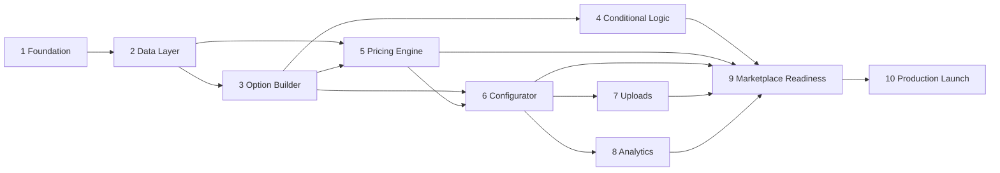

# 06 — Engineering Roadmap

**Scope:** Phase 6. Sequences the build into 10 dependency-ordered phases. Each phase lists objectives,
deliverables, dependencies, risks, complexity, and **relative effort** (T-shirt sizing). **No calendar
or time estimates** — sequencing and relative sizing only, per the planning rules.

Phases map to the extension map (doc 03), the feature TDD (doc 02), the collections (doc 04), and the
UX screens (doc 05). The backlog (doc 08) decomposes each phase into Epic→Feature→Story→Task→Test.

**Legend** — Complexity: ◔ low · ◑ medium · ◕ high · ● very high. Effort (relative): S · M · L · XL.

---

## Phase map at a glance

| # | Phase | Build wave | Complexity | Effort | Hard dependencies |
|---|-------|-----------|-----------|--------|-------------------|
| 1 | Foundation | MVP | ◑ | M | — |
| 2 | Data Layer | MVP | ◑ | M | P1 |
| 3 | Option Builder | MVP | ◕ | L | P2 |
| 4 | Conditional Logic Engine | V2 | ● | L | P3 |
| 5 | Pricing Engine | MVP→V2 | ● | XL | P2, P3 |
| 6 | Product Configurator (storefront) | MVP | ● | XL | P3, P5 |
| 7 | Upload System | V2 | ◕ | L | P6 |
| 8 | Analytics | V2 | ◑ | M | P6 |
| 9 | Marketplace Readiness | gate | ◕ | L | P1–P8 |
| 10 | Production Launch | gate | ◑ | M | P9 |

**Critical path:** P1 → P2 → P3 → P5 → P6 → P9 → P10. Conditional Logic (P4), Uploads (P7), and
Analytics (P8) branch off and rejoin before the readiness gate. V2/V3/V4 feature depth (Visual Preview,
B2B/quotes, AI) is layered as extensions of P4–P8 and listed per phase under "Versioned extensions."

---

## Phase 1 — Foundation

**Objectives:** Stand up the Wix CLI app skeleton, the Sapphire theme layer, billing gating, and the
shared isomorphic engine packages so every later phase builds on a consistent base.

**Deliverables:**
- Wix CLI app initialized; `wix.config.json`; scripts (`build`/`release`/`dev`/`preview`).
- **SapphireThemeProvider** + scoped global token stylesheet (doc 05 §2); token-lint CI gate.
- Dashboard shell: Overview page (S1), nav/breadcrumb chrome, Command Palette, Priority Status Rail,
  Detail Inspector Drawer primitive, Empty/Error state primitives.
- `appInstance.ts` (`getAppInstanceElevated`, `isPremiumInstance`) + plan→feature flag map (doc 03 §6).
- App Installed/Removed event handlers (skeleton): demo-data seed hook (#37) + cleanup hook.
- Shared package scaffolds: `@configurator/core` (types), `rules-engine.ts`, `pricing-engine.ts` (pure,
  empty), `stores-catalog.ts` (V1/V3 abstraction with `getCatalogVersion()`).
- CI: typecheck, build, token-lint, visual-regression harness, axe harness.

**Dependencies:** none (entry point).
**Risks:** Sapphire-over-WDS theming integrity (doc 05 §2/§9) must be proven here, not retrofitted —
establish the scoped-override pattern + gates on day one. App namespace (MA-1) needed before collections.
**Complexity ◑ · Effort M.**

---

## Phase 2 — Data Layer

**Objectives:** Create all data collections and the typed data-access layer the dashboard + SPIs share.

**Deliverables:**
- Data Collection extensions for all 12 core collections + V2/V3 extension collections (doc 04), with
  scoped IDs `<namespace>/<idSuffix>`, indexes (incl. unique), and per-op permissions.
- `database.ts`-style typed repository per collection (mirrors `shipping-rates`); insert-path validation
  (required/unique/default enforced in code — Wix Data lacks field-level constraints).
- `Settings` singleton bootstrap on install; retention-policy stubs.
- Seed/demo-data module (#37) wired to App Installed.

**Dependencies:** P1 (namespace, app shell).
**Risks:** No Wix-entity references → product IDs stored as TEXT (doc 04); get the reference model right
now to avoid rework. Permission scoping errors surface late — unit-test each op's context.
**Complexity ◑ · Effort M.**

---

## Phase 3 — Option Builder

**Objectives:** Merchants create/edit/publish option sets — the core authoring experience and the data
foundation every downstream feature consumes.

**Deliverables:**
- Option Sets list (S2) + Builder Options tab (S3): ordered options, all option types, value editing,
  validation config, keyboard/drag reorder, autosave, section grouping.
- Create/clone/delete/publish modals (S8); draft→published versioning.
- Web methods (`webMethod(Permissions.Admin, …)`) for set/option CRUD + publish; React Query hooks.
- Assign tab (S6) MVP: single-product mapping via Stores picker (V1/V3 gated); `ProductMappings` writes.
- Preview tab (S7) embedding the storefront core in advisory mode.

**Dependencies:** P2 (collections, repositories).
**Risks:** Builder is the most interaction-dense dashboard surface — enforce the 7-Action Cap /
3-Decision Limit (doc 05 §1) or it becomes overwhelming. Reorder must be a11y-operable (#53).
**Versioned extensions:** Templates gallery (S9, V2/Pro); bulk assign (V2).
**Complexity ◕ · Effort L.**

---

## Phase 4 — Conditional Logic Engine

**Objectives:** Visibility/requirement/availability rules with a visual builder, an isomorphic
evaluator, and a simulator.

**Deliverables:**
- `rules-engine.ts` complete: nested AND/OR condition trees, `evaluateRules(config, rules)` pure,
  bounded, deterministic; cycle detection; stable ordering.
- Rules tab (S4): condition-tree builder, actions editor, **simulator panel**, invalid-rule diagnostics.
- `ConditionalRules` persistence + versioning; storefront wiring (engine drives live visibility/required).

**Dependencies:** P3 (options exist to reference).
**Risks:** Rule evaluation correctness + performance (<16.67ms interaction budget); nested logic UX
complexity; storefront and server must use the **same** engine to avoid drift (doc 02).
**Complexity ● · Effort L.**

---

## Phase 5 — Pricing Engine

**Objectives:** Server-authoritative live pricing across fixed/percentage/tier/quantity/conditional/
formula strategies, injected into checkout via the Additional Fees SPI.

**Deliverables:**
- `pricing-engine.ts` complete: documented composition order (base→fixed→tier→quantity→percentage→
  formula→conditional→rounding); **whitelisted formula grammar, no `eval`/`Function`**, <100ms.
- Pricing tab (S5): per-type rule editors, inline formula validation, live preview.
- **Additional Fees SPI** (`ECOM_ADDITIONAL_FEES`) — per-line-item surcharge, price as STRING,
  **fail-open** to no fee on error; reads config via elevated query.
- **Validations SPI** (`ECOM_VALIDATIONS`) — **fail-closed** when required configuration missing.
- `PricingRules` persistence; storefront advisory price preview (fixed slot, no layout shift).

**Dependencies:** P2 (PricingRules) + P3 (options); pairs with P4 for conditional pricing.
**Risks:** **Highest-stakes correctness** — wrong checkout price is a trust/financial failure. Client
preview vs server authority must reconcile; money-as-string + currency handling; fail-open vs fail-closed
discipline per SPI. Formula sandbox security (#64/#78).
**Versioned extensions:** rich tier/quantity/conditional + formula = Pro (V2); MVP ships fixed/percentage.
**Complexity ● · Effort XL.**

---

## Phase 6 — Product Configurator (storefront)

**Objectives:** The shopper-facing configurator on the Stores product page — live options, rules,
pricing preview, add-to-cart with server recompute.

**Deliverables:**
- **Site Plugin** (W1, product-page slot) + **Custom Element** (W2, flexible) sharing `@configurator/core`,
  full Sapphire CSS, zero WDS (doc 05 §2/§6).
- Live selection state; rules-engine + pricing-engine in advisory mode; fixed price slot (<100ms, CLS≤0.005).
- Add-to-cart writes configuration; checkout triggers Additional Fees + Validations SPIs (server authority).
- `Configurations` draft persistence; `OrderConfigurations` capture via order event/webhook.
- No `<h1>` (#55); responsive/mobile-first (#52); reduced-motion compliant.

**Dependencies:** P3 (sets) + P5 (pricing); consumes P4 when present.
**Risks:** Performance budget on real product pages; cart/checkout SPI integration is the riskiest
end-to-end seam; editor-preview vs published parity (#170); catalog V1/V3 storefront differences.
**Versioned extensions:** multi-step flow (W3, V2); Visual Preview (W5 + S16 mapper, V2/Business);
quote request (W6, V3/Enterprise).
**Complexity ● · Effort XL.**

---

## Phase 7 — Upload System

**Objectives:** Customer file uploads with validation, virus scanning, secure storage, and merchant
access.

**Deliverables:**
- Storefront upload control (W4): type/size allow-list, progress, inline validation, mobile capture.
- Wix Media storage; **external virus-scan** (MA-4) + quarantine state; scan-failed files non-downloadable.
- `Uploads` collection (signed refs, scan status); merchant file access in Order inspector (S11) with
  per-order bulk download.

**Dependencies:** P6 (configurator hosts the upload field; orders capture refs).
**Risks:** **Security-critical** (malware via PSD/AI/ZIP) — quarantine before merchant access; signed
short-lived URLs; scan-provider latency/availability (degrade gracefully). Privacy/retention of buyer files.
**Complexity ◕ · Effort L.**

---

## Phase 8 — Analytics

**Objectives:** Configuration funnel + option insights for merchants, consent-respecting and
event-based.

**Deliverables:**
- Event capture (`AnalyticsEvents`): view/start/step/option-select/complete/add-to-cart; batched writes;
  **no pre-consent tracking** (#92/#97); event-level (non-PII) by default.
- Analytics dashboard (S12): Sapphire Metric Cards (views/completion/revenue/AOV), funnel, drop-off,
  option popularity; date filter; empty/low-data states; per-tile error isolation.
- Retention policy (MA-7) enforcement.

**Dependencies:** P6 (storefront emits events).
**Risks:** Write volume/batching at scale; consent correctness; metric accuracy vs Stores order data.
**Complexity ◑ · Effort M.**

---

## Phase 9 — Marketplace Readiness

**Objectives:** Close every App Market gate (doc 07) and harden the app for review.

**Deliverables:**
- Full doc 07 submission checklist green: billing per-tier test, signed-instance/`signDate`, min
  permissions, V1+V3 verified, no `alert/confirm`, no widget `<h1>`, demo data, webhooks 200.
- Sapphire-over-WDS pre-submission review (doc 07 §9.2) signed off.
- Gates green: token-lint, visual-regression (≤0.25px), axe a11y, CLS/perf budgets, zero console errors.
- Browser/device matrix; site-duplication (`originInstanceId`) path; upload security verification.
- Listing assets, privacy note, pricing copy (MA-3, MA-5).

**Dependencies:** P1–P8.
**Risks:** Readiness findings that force rework if deferred — run the doc 07 checklist incrementally from
P1, not only here. Sapphire override is the top review risk (doc 07 §9).
**Complexity ◕ · Effort L.**

---

## Phase 10 — Production Launch

**Objectives:** Release, observe, and stabilize in production.

**Deliverables:**
- `wix app release` to production; phased rollout; rollback procedure.
- Observability: structured logs, SPI error-rate + latency alarms (fail-open fee tracking, validation
  blocks), upload-scan failure alerts, install/billing funnels.
- Support runbook (Stores-not-installed, scan outage, pricing dispute, V1/V3 edge cases).
- Post-launch backlog grooming for V2/V3/V4 waves.

**Dependencies:** P9 (approved).
**Risks:** Live checkout incidents (pricing/validation) need fast rollback; scan-provider/SPI dependency
outages; support load at scale.
**Complexity ◑ · Effort M.**

---

## Versioned delivery waves (cross-phase)

| Wave | Plan tier | Phases extended | Key features |
|------|-----------|-----------------|--------------|
| **MVP** | Free/Starter | P1–P3, P5(fixed/%), P6 core, P9, P10 | Option sets, single mapping, fixed/percentage pricing, storefront configurator, checkout SPIs |
| **V2** | Pro / Business | P4, P5(full), P6(W3/W5), P7, P8, S9, S16 | Conditional logic, formula/tier/quantity pricing, uploads, templates, analytics, visual preview, bulk assign, option inventory |
| **V3** | Enterprise | P6(W6), S14, S15 | B2B quotes/request-a-quote, audit logs + export |
| **V4** | Enterprise | extends P3/P4 | AI Assist set/rule drafting (S17) |

Effort sizing is relative complexity only; no schedule is implied. The backlog (doc 08) carries the
task-level decomposition and test tasks per phase.
